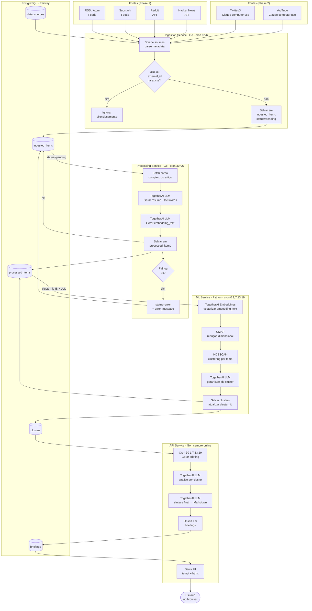

# Briefing Curator — Design Spec
**Date:** 2026-04-23
**Status:** Approved

## Overview

Personal curation and briefing system that ingests content from RSS feeds, blogs, Substack, Reddit, and Hacker News, groups related content by topic via ML clustering, and delivers a daily curated briefing via web interface.

Twitter and YouTube are supported in a second phase via Claude computer use agents.

---

## Tech Stack

| Layer | Technology |
|---|---|
| Core services | Go |
| ML / clustering | Python |
| LLM / embeddings | TogetherAI API |
| Browser automation | Claude computer use (phase 2) |
| Database | PostgreSQL |
| Infrastructure | Railway (all services + DB) |
| Frontend | templ + htmx (served by API Service) |

---

## Architecture

Three services + one cron pair share a single PostgreSQL instance on Railway. The frontend is served directly by the API Service — no separate frontend deployment.

```
┌─────────────────────────────────────────────────────┐
│                     Railway                          │
│                                                      │
│  ┌──────────────┐    ┌──────────────────────────┐   │
│  │  Ingestion   │    │   Processing Service     │   │
│  │  Service     │───▶│  (Go) fetch + summarize  │   │
│  │  (Go cron)   │    └────────────┬─────────────┘   │
│  └──────────────┘                 │                  │
│                                   ▼                  │
│  ┌──────────────┐    ┌──────────────────────────┐   │
│  │  ML Service  │◀───│       PostgreSQL          │   │
│  │  (Python)    │───▶│                          │   │
│  │  embeddings  │    └────────────┬─────────────┘   │
│  │  + cluster   │                 │                  │
│  └──────────────┘                 ▼                  │
│                       ┌──────────────────────────┐   │
│                       │    API Service (Go)      │   │
│                       │  brief gen + HTTP server │   │
│                       │  templ + htmx UI         │   │
│                       └────────────┬─────────────┘   │
└────────────────────────────────────┼────────────────┘
                                     │
                               browser (user)
```

---

## Pipeline Flow



---

## Services

### Scheduling Model

All services run as **poll-based Railway cron jobs** — each checks for pending work and exits cleanly if there's nothing to do. This avoids inter-service webhooks and keeps Railway config simple.

| Service | Cron schedule | Offset rationale |
|---|---|---|
| Ingestion | `0 */6 * * *` | Runs at 0h, 6h, 12h, 18h |
| Processing | `30 */6 * * *` | 30min after ingestion |
| ML Service | `0 1,7,13,19 * * *` | 1h after ingestion |
| Brief generation (API) | `30 1,7,13,19 * * *` | 30min after ML |

---

### Ingestion Service (Go — Railway cron, every 6h)

Scrapes configured sources and stores raw metadata. Idempotent by design — running twice produces no duplicates.

**Supported sources (MVP):**
- RSS / Atom feeds (including Substack public feeds) — via `gofeed`
- Reddit — official API, free tier
- Hacker News — public API (`hacker-news.firebaseio.com`)

**Behavior:**
- Fetches each active `data_source`
- Upserts into `ingested_items` using `ON CONFLICT DO NOTHING`
- Logs skipped duplicates silently
- Does not fetch article body — only metadata (title, URL, author, published_at)

---

### Processing Service (Go — triggered after ingestion)

Fetches full article content and generates a summary and embedding text for each pending item.

**Steps per item:**
1. HTTP fetch of article URL + HTML-to-text extraction
2. TogetherAI LLM call → short summary (~150 words)
3. TogetherAI LLM call → `embedding_text` (structured representation optimized for embedding)
4. Update `ingested_items.status = done`, insert `processed_items`

**Error handling:** items that fail 3 times are set to `status = error` with the error message stored. Visible in the web panel.

---

### ML Service (Python — triggered after processing)

Clusters the day's processed items by topic using embeddings.

**Steps:**
1. Fetch all `processed_items` without a `cluster_id` for the target date
2. Call TogetherAI Embeddings API to vectorize each `embedding_text`
3. UMAP — dimensionality reduction
4. HDBSCAN — unsupervised topic clustering
5. For each cluster: call TogetherAI LLM to generate a human-readable `label`
6. Persist clusters to `clusters`, update `processed_items.cluster_id`

---

### API Service (Go — always online)

Orchestrates briefing generation and serves the web UI via templ + htmx. No separate frontend service — HTML is rendered server-side and returned directly to the browser. htmx handles dynamic updates (partial page swaps) without any JavaScript framework.

**Briefing generation (triggered after ML service):**
1. For each cluster: TogetherAI LLM call → cluster analysis paragraph
2. Final TogetherAI LLM call → synthesize all cluster analyses into one briefing (Markdown)
3. Upsert into `briefings` (idempotent by date)

**Web routes (HTML via templ):**
- `GET /` — redirect to latest briefing
- `GET /briefings/:date` — render full briefing page
- `GET /sources` — source manager page
- `GET /items` — ingested items list with status indicators

**HTMX endpoints (HTML fragments):**
- `POST /sources` — add source, returns updated source list fragment
- `PATCH /sources/:id/toggle` — enable/disable, returns updated row fragment
- `GET /items?source=&status=` — filtered items fragment

No JSON API in Phase 1 — templ renders everything server-side.

---

### Computer Use Agent (Python — Phase 2)

Separate Railway service, triggered manually or by cron.

**Sources:**
- Twitter/X — scrapes timeline and specific lists via Claude computer use
- YouTube — scrapes personal playlist items via Claude computer use

**Output:** inserts results into `ingested_items` with `type = twitter` or `type = youtube`, entering the same pipeline as RSS items.

---

## Database Schema

```sql
-- Configured sources
CREATE TABLE data_sources (
  id          UUID PRIMARY KEY DEFAULT gen_random_uuid(),
  type        TEXT NOT NULL CHECK (type IN ('rss','reddit','hn','substack','twitter','youtube')),
  url         TEXT NOT NULL,
  name        TEXT NOT NULL,
  active      BOOLEAN NOT NULL DEFAULT true,
  created_at  TIMESTAMPTZ NOT NULL DEFAULT now()
);

-- Raw scraped items
CREATE TABLE ingested_items (
  id           UUID PRIMARY KEY DEFAULT gen_random_uuid(),
  source_id    UUID NOT NULL REFERENCES data_sources(id),
  external_id  TEXT NOT NULL,
  title        TEXT NOT NULL,
  url          TEXT NOT NULL,
  author       TEXT,
  published_at TIMESTAMPTZ,
  raw_content  TEXT,
  status       TEXT NOT NULL DEFAULT 'pending'
                 CHECK (status IN ('pending','processing','done','error')),
  error_message TEXT,
  ingested_at  TIMESTAMPTZ NOT NULL DEFAULT now(),

  UNIQUE (source_id, external_id),
  UNIQUE (url)
);

-- Topic clusters generated by ML service (defined before processed_items due to FK)
CREATE TABLE clusters (
  id             UUID PRIMARY KEY DEFAULT gen_random_uuid(),
  briefing_date  DATE NOT NULL,
  label          TEXT NOT NULL,
  item_count     INTEGER NOT NULL DEFAULT 0,
  created_at     TIMESTAMPTZ NOT NULL DEFAULT now()
);

-- Processed items with summary and embedding text
CREATE TABLE processed_items (
  id               UUID PRIMARY KEY DEFAULT gen_random_uuid(),
  ingested_item_id UUID NOT NULL REFERENCES ingested_items(id),
  summary          TEXT NOT NULL,
  embedding_text   TEXT NOT NULL,
  cluster_id       UUID REFERENCES clusters(id),
  processed_at     TIMESTAMPTZ NOT NULL DEFAULT now()
);

-- Generated briefings
CREATE TABLE briefings (
  id         UUID PRIMARY KEY DEFAULT gen_random_uuid(),
  date       DATE NOT NULL UNIQUE,
  content    TEXT NOT NULL,
  status     TEXT NOT NULL DEFAULT 'draft' CHECK (status IN ('draft','published')),
  created_at TIMESTAMPTZ NOT NULL DEFAULT now()
);
```

---

## Pipeline Status Flow

```
ingested_items.status:
  pending → processing → done → (cluster_id set by ML service)
                       → error (after 3 failed attempts)
```

The Processing Service queries `WHERE status = 'pending'`.
The ML Service queries `processed_items WHERE cluster_id IS NULL` for the target date.
Briefing generation runs after the ML service completes.

---

## Deduplication

Two constraints prevent duplicate ingestion:
- `UNIQUE (source_id, external_id)` — same item from same source
- `UNIQUE (url)` — same URL appearing across different sources

The Ingestion Service uses `INSERT ... ON CONFLICT DO NOTHING` and logs skipped items at DEBUG level.

---

## Error Handling

| Layer | Strategy |
|---|---|
| Ingestion | Retry per source with exponential backoff; source errors don't block other sources |
| Processing | Per-item retry up to 3x; `status=error` with message on final failure |
| ML Service | Full retry on transient TogetherAI errors; hard fail logged on clustering error |
| API Service | Standard HTTP error responses; briefing generation is idempotent (upsert by date) |

---

## Observability

- Structured JSON logs via Go `slog` (native, no external dependency)
- Railway log aggregation handles collection
- `error_message` on `ingested_items` makes failures visible in the web panel
- No external monitoring in MVP — Railway dashboard is sufficient

---

## Testing Strategy

| Service | Approach |
|---|---|
| Ingestion | Unit tests on parsers (RSS, Reddit, HN) with response fixtures; integration test for upsert/dedup against real Postgres |
| Processing | Unit tests on HTML-to-text extraction; TogetherAI API mocked in tests |
| ML Service | Sanity test on clustering pipeline with a fixed dataset |
| API Service | Integration tests on HTTP handlers against real Postgres (no DB mocking); templ rendering tested via `httptest` |

Local development uses Docker Compose with an ephemeral Postgres instance. `make test` runs the full suite.

---

## Phasing

### Phase 1 — MVP
- Ingestion: RSS, Substack, Reddit, Hacker News
- Processing + ML clustering
- Web interface via templ + htmx (briefing reader + source manager)
- Deployed on Railway

### Phase 2
- Computer use agent for Twitter/X and YouTube
- Email delivery (newsletter to personal inbox)

---

## Repository Structure (proposed)

```
/
├── services/
│   ├── ingestion/        # Go — cron scraper
│   ├── processing/       # Go — content fetch + summarize
│   ├── api/              # Go — HTTP server + brief gen + templ templates
│   │   └── templates/    # templ .templ files (compilados para Go)
│   ├── ml/               # Python — embeddings + clustering
│   └── computer-use/     # Python — Claude browser agent (phase 2)
├── packages/
│   └── database/         # Migrations (goose)
└── docker-compose.yml    # Local development
```
